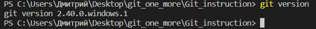

# Инструкция по git
## 1.Проверка наличия установленого git.
в терминале выполняем команду git version.

Если git установлен, появится сообщение с информацией о версии файла иначе будет сообщение об ошибке.

## 2.Настойка git
на этом этапе введя команды "git config --global user name or emale" я обозначил программ как меня зовут и почту. 

Думаю это необходимо для удобной работы нескольких человек что бы отслеживать кто внес изменения и как с ним связаться.
## 3.инициализация репозитория 
Далее командой "git init <name_file>" я сдел этот фаил репозиторием и git начал за ним следить
## 4.сохраниение измениния файла 
Что бы сохданить текущее состояния файла необходимо: 
* сохранить (индикатор сохданения в виде белого круга рядом с именем файла над рабочей облостью. Еили он есть значит не сохранено). Для этого либо:
    * файл-->сохранить
    * CTRL+s
    * файл --> автосохранения (напроти должна быть галочка)
* Пишу команду <git_add_.> Тем смамы добавляю текущее состояние файла 

*примечание:* почему то требует после add потоавить пробел и точку инче команду не выполняет.
* Пишу команду <git_commit -m "коменнтарий"> в коментарии записываю проделаную работу (писать комментарий обязательно).
**После первого раза можно заменить -m на -am и не выполнять предыдущий пунтк**

## 5.Записи изменений в репозитории 
Или же команда команда <git_commit> относиться к этому пункту, не совсем понял этот заголовок 

*Примечание* перестать писать commin вместо  commit. Не понимаю почему так происходит.
## 6.получение информации о работе commit 
Введя команду <git_status> я узнаю состояния всех текщих сохранений.

вызвав эту команду git  мне сообщает что в главной ветви (main/master) было выполнино 2 команды commit и ни одной команды в иных ветвях 

(On branch main
Your branch is ahead of 'origin/main' by 2 commits.
  (use "git push" to publish your local commits)

nothing to commit, working tree clean)

если указывается меньшее количесто команд чем я прописывал значит было не выполнино что то из пунта  4
## 7.сравнение с последним commit

До выполнения команды commit если пропишу команду <git_diff> Мне покажет все изменения которые я внем с момента предыдущего сохранения.

Знаком + и текстом зеленого цвета указываются все добавленые столки. Знаком - и текстом красного цвета указаны все удаленые строки.

        P.S. узнать можноли ли настроить git что бы указывался номера строк где были изменения. В большом тексте будет сложно разобраться.

## 8.перемещение между сохраниниями 

прописав команду <git_log> получим информацию о всех ранее совршеных commit с коментариями, датой и именем с почтой кто их делал. 

    P.S. все расписываю с другого компьютера. Репозиторий скачал с GitHubb. Сам код весь есть, но ни истории терминала и предыдущих commit нет. Думаю так быть не должно. Разобраться.

Затем выполняя команду <git_checkout_*number> (*номер commit) откачусь к предыдущему сохранеию.

Что бы вернуться к актуальной версии файла введу команду <git_checkout_main/master>

*Примечания:*

тебя не пустит в другое сохранение пока не сделаешь commit текущего файла.
После перехода в другой commit не забудь нажать **Q** что бы начать печатать в терминале. Что бы быстро спуститься в самый низ жми пробел.

*Примечание:* Если забудешь какунибудь из команд пиши <git_--help>, git нипишет небольшой списко возможных команд, но я думаю это не все. Разобраться. 

Обрати внимание. Если совершаешь орфагрофическую ошибку git спросит "возможно ты имел в виду..." и пишет правильную команду 
## 9.Отправка в GitHubb и работа нанескольких устройствах 
    P.S прошу проверяющего этот пункт прокоментировать т.к. этот пункт делал сам мжно сказать на угат
Этот пункт начал делать после начала работы над файлом (наверное это не првильно). 

Сначала зарегистрироваля на сайте [GitHubb](https://github.com/DimonSurgut/Git_instruction/blob/main/Git_instruction.) md. Там в вкладке своего профиля в пункте <Repositories> загрузил папку с файлом за которым следит Git. 

Затем с другого устройства также зашел на сайт под тем же профилем. В visual_Studio ввел команду <git_clone> затем нажал на появившееся окно, выбрал пустую папку в которой будет файл, сайт опять попросил пароль и устоновил конект с устройством. 

Файл открылся в том виде в которм его сохранял, но как писал ранее небыло истории терминала.

    P.S. так же не сохранились нрафические файли jpg. и png. которые испольовал в тексте. И отправить на GitHub тоже не дает(показывает бесконечную загрузку файла) из за картинки. Пробовал перейти в раздел с каткинкой и пременить команды init, add, commit ничего не аботает. Пишет файл не отслеживается (картинка находится в папке  файлом) Подскажите как исправить. 
    
![ghp][def]

Для сохранения изменеий в GitHub выполняю commit, в левой части окна в разделе с git нажимаю кнопку фиксация 

Попытался на первом устройстве открыть уже измененый файл тем же образом (через команду <git_clon>), но в ответ получил не понятную ошибку. Получилось только заново скачать репозиторий с сайта, но думаю так работать не должно. Разобраться.

[def]: error.png kjslg
